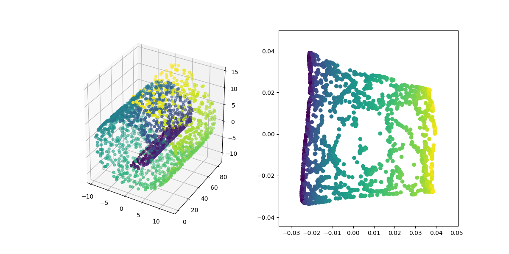
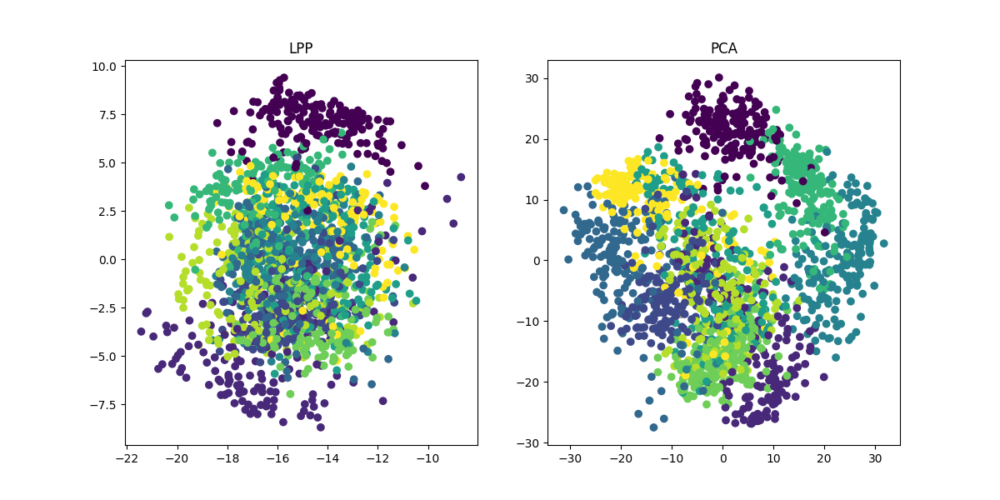

# DimensionalityReduction_alo_codes

**网上关于各种降维算法的资料参差不齐，同时大部分不提供源代码；在此通过借鉴资料实现了一些经典降维算法的Demo(python)，同时也给出了参考资料的链接。**

降维算法|资料链接|代码|展示|
---|---|---|---
PCA | [资料链接１](https://blog.csdn.net/u013719780/article/details/78352262) [资料链接２](https://blog.csdn.net/u013719780/article/details/78352262) [资料链接３](https://blog.csdn.net/weixin_40604987/article/details/79632888) | [PCA](https://github.com/heucoder/dimensionality_reduction_alo_codes/tree/master/codes/PCA) | 
KPCA | [资料链接1](https://blog.csdn.net/u013719780/article/details/78352262) [资料链接2](https://blog.csdn.net/u013719780/article/details/78352262) [资料链接3](https://blog.csdn.net/weixin_40604987/article/details/79632888) |[KPCA](https://github.com/heucoder/dimensionality_reduction_alo_codes/tree/master/codes/PCA) |
LDA | [资料链接１](https://blog.csdn.net/ChenVast/article/details/79227945) [资料链接2](https://www.cnblogs.com/pinard/p/6244265.html) | [LDA](https://github.com/heucoder/dimensionality_reduction_alo_codes/tree/master/codes/LDA) | 
MDS | [资料链接１](https://blog.csdn.net/zhangweiguo_717/article/details/69663452?locationNum=10&fps=1) | [MDS](https://github.com/heucoder/dimensionality_reduction_alo_codes/tree/master/codes/MDS) |  
ISOMAP | [资料链接１](https://blog.csdn.net/zhangweiguo_717/article/details/69802312) [资料链接２](http://www-clmc.usc.edu/publications/T/tenenbaum-Science2000.pdf) | [ISOMAP](https://github.com/heucoder/dimensionality_reduction_alo_codes/tree/master/codes/ISOMAP) | 
LLE | [资料链接１](https://blog.csdn.net/scott198510/article/details/76099630) [资料链接2](https://www.cnblogs.com/pinard/p/6266408.html?utm_source=itdadao&utm_medium=referral) | [LLE](https://github.com/heucoder/dimensionality_reduction_alo_codes/tree/master/codes/LLE) |
TSNE | [资料链接１](http://bindog.github.io/blog/2018/07/31/t-sne-tips/) | [TSNE](https://github.com/heucoder/dimensionality_reduction_alo_codes/tree/master/codes/T-SNE) |
AutoEncoder |无　| |
FastICA | [资料链接１](https://blog.csdn.net/lizhe_dashuju/article/details/50263339) |[FastICA](https://github.com/heucoder/dimensionality_reduction_alo_codes/tree/master/codes/ICA) |
SVD | [资料链接１](https://blog.csdn.net/m0_37870649/article/details/80547167) [资料链接2](https://www.cnblogs.com/pinard/p/6251584.html) | [SVD](https://github.com/heucoder/dimensionality_reduction_alo_codes/tree/master/codes/SVD) |
LE | [资料链接1](https://blog.csdn.net/hustlx/article/details/50850342)[资料链接2](https://blog.csdn.net/jwh_bupt/article/details/8945083) | [LE](https://github.com/heucoder/dimensionality_reduction_alo_codes/tree/master/codes/LE) | 
LPP | [资料链接１](https://blog.csdn.net/qq_39187538/article/details/90402961) [资料链接２](https://blog.csdn.net/xiaohen123456/article/details/82288222) | [LPP](https://github.com/heucoder/dimensionality_reduction_alo_codes/tree/master/codes/LPP) | 

`环境: python3.6 ubuntu18.04(windows10)`
`需要的库: numpy sklearn tensorflow matplotlib`
- 每一个代码都可以单独运行，但是只是作为一个demo，仅供学习使用
- 其中AutoEncoder只是使用AutoEncoder简单的实现了一个PCA降维算法,自编码器涉及到了深度学习领域，其本身就是一个非常大领域
- LE算法的鲁棒性极差，对近邻的选择和数据分布十分敏感
- **2019.6.20添加了LPP算法，但是效果没有论文上那么好，有点迷，后续需要修改**
