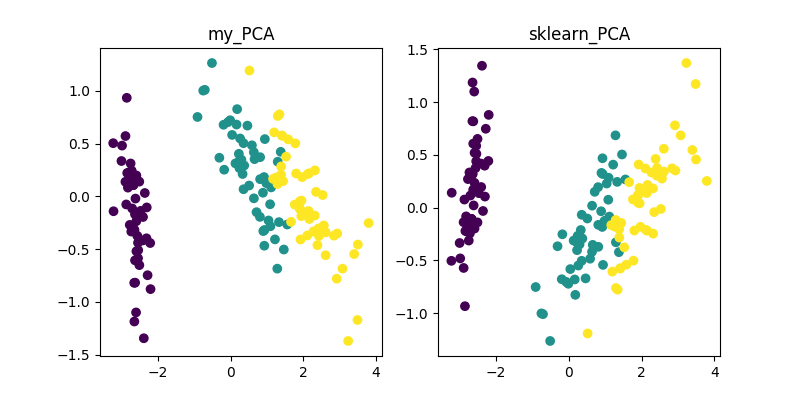
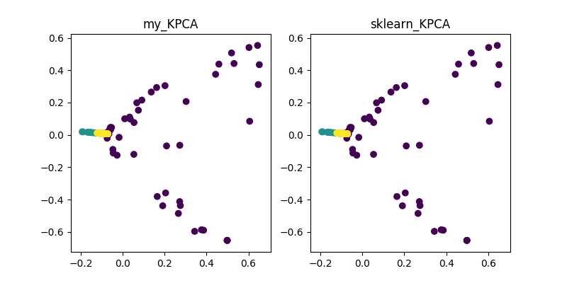
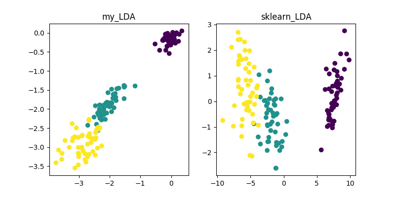
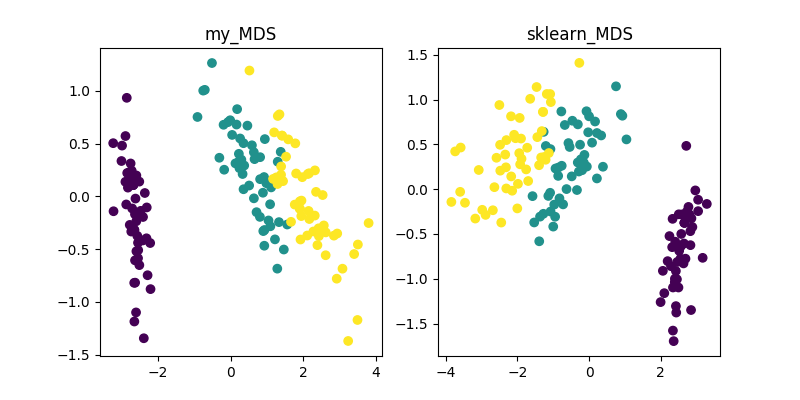
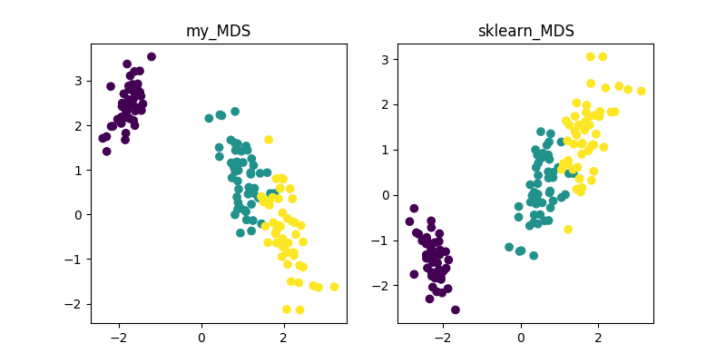
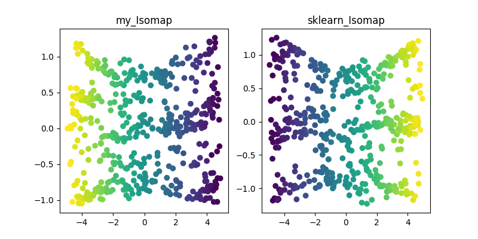
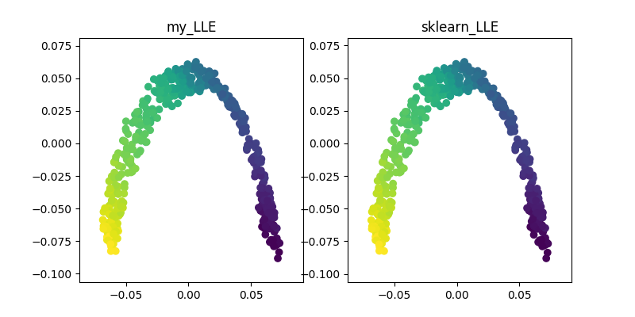
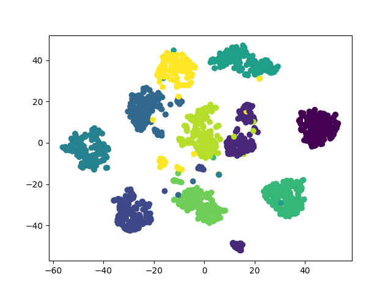
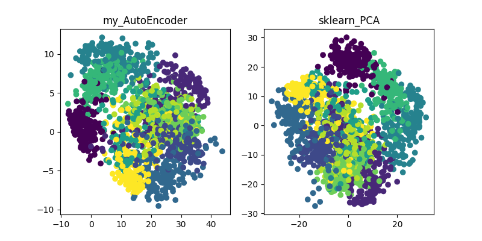
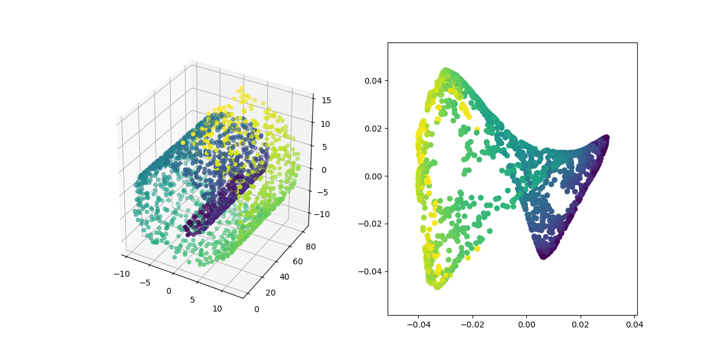

# DimensionalityReduction_alo_codes

**网上关于各种降维算法的资料参差不齐，同时大部分不提供源代码；在此通过借鉴资料实现了一些经典降维算法的Demo(python)，同时也给出了参考资料的链接。**

降维算法|资料链接|展示|
---|---|---
PCA | https://blog.csdn.net/u013719780/article/details/78352262 https://blog.csdn.net/u013719780/article/details/78352262 https://blog.csdn.net/weixin_40604987/article/details/79632888 |  
KPCA | https://blog.csdn.net/u013719780/article/details/78352262 https://blog.csdn.net/u013719780/article/details/78352262 https://blog.csdn.net/weixin_40604987/article/details/79632888 | 
LDA | https://blog.csdn.net/ChenVast/article/details/79227945 https://www.cnblogs.com/pinard/p/6244265.html | 
MDS | https://blog.csdn.net/zhangweiguo_717/article/details/69663452?locationNum=10&fps=1 |  
ISOMAP | https://blog.csdn.net/zhangweiguo_717/article/details/69802312 http://www-clmc.usc.edu/publications/T/tenenbaum-Science2000.pdf | 
LLE | https://blog.csdn.net/scott198510/article/details/76099630 https://www.cnblogs.com/pinard/p/6266408.html?utm_source=itdadao&utm_medium=referral | 
TSNE | http://bindog.github.io/blog/2018/07/31/t-sne-tips/ | 
AutoEncoder |无　| 
FastICA | https://blog.csdn.net/lizhe_dashuju/article/details/50263339
SVD | https://blog.csdn.net/m0_37870649/article/details/80547167 https://www.cnblogs.com/pinard/p/6251584.html | 
LE | https://blog.csdn.net/hustlx/article/details/50850342# https://blog.csdn.net/jwh_bupt/article/details/8945083 | 

`环境: python3.6 ubuntu18.04(windows10)`
`需要的库: numpy sklearn tensorflow matplotlib`
- 每一个代码都可以单独运行，但是只是作为一个demo，仅供学习使用
- 其中AutoEncoder只是使用AutoEncoder简单的实现了一个PCA降维算法,自编码器涉及到了深度学习领域，其本身就是一个非常大领域
- LE算法的鲁棒性极差，对近邻的选择和数据分布十分敏感
